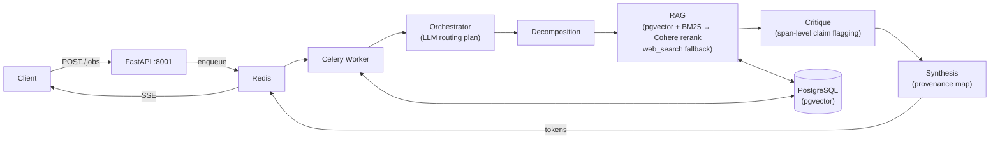

# Mega AI

A production multi-agent LLM system built around a four-agent async pipeline (Decomposition → RAG → Critique → Synthesis), orchestrated by an LLM-generated JSON routing plan. The system answers research-style queries with span-level claim provenance, ships with a 15-case adversarial eval harness scored across six dimensions, and includes a meta-agent that proposes prompt rewrites for failing cases.

**Stack:** FastAPI, Gemini 2.0 Flash, OpenAI Embeddings, Cohere Rerank, pgvector, PostgreSQL, Redis, Celery, Docker Compose.

---

## Quick Start

Designed for zero-friction setup.

**Prerequisites:** Docker, Docker Compose, and `.env` configured with `GOOGLE_API_KEY`, `OPENAI_API_KEY`, and `COHERE_API_KEY`.

```bash
# 1. Clone and configure keys
git clone <repo> && cd mega-ai
cp .env.example .env

# 2. Boot the system (runs migrations, seeds DB, generates embeddings automatically)
docker compose up -d

# 3. Submit a query
curl -X POST http://localhost:8001/jobs \
  -H "Content-Type: application/json" \
  -d '{"query": "What is the time complexity of binary search and why?"}'

# 4. Stream the execution live using the job_id returned above
curl -N http://localhost:8001/jobs/<job_id>/stream
```

### Testing & Observability
- **Test Suite**: Run the 91-case test suite verifying pipeline integrity, token budgets, and the code sandbox AST rules: `docker compose exec api uv run pytest`
- **Trace Output**: View the full database lifecycle trace: `curl -s http://localhost:8001/jobs/<job_id>/trace | jq`
- **Eval Summary**: View the latest eval run: `curl http://localhost:8001/eval/latest`

---

## Architecture



The **Orchestrator** generates a JSON routing plan on every request to dynamically assign the execution graph and tool whitelists. All state changes are emitted to Redis pub/sub and streamed to the SSE client.

---

## API Endpoints

The FastAPI service exposes five strictly-typed endpoints:

| Endpoint | Method | Description |
|---|---|---|
| `/jobs` | `POST` | Submits a query to the pipeline. Returns a `job_id` and immediately enqueues a Celery task. |
| `/jobs/{id}/stream` | `GET` | Server-Sent Events (SSE) endpoint. Streams token-by-token reasoning, budget updates, and tool calls in real time via a Redis buffer. Late-subscribers receive history. |
| `/jobs/{id}/trace` | `GET` | Fetches the full lifecycle of a completed job from PostgreSQL, including the exact `provenance_map`, the latency of every agent, and the JSON tool call log. |
| `/eval/latest` | `GET` | Returns the most recent 15-case adversarial evaluation result, broken down by test category and scoring dimension. |
| `/prompts/{id}/review` | `POST` | Human-in-the-loop endpoint to approve or reject a prompt rewrite proposed by the Meta-Agent. |

---

## Core Schema (Shared Context)

Instead of passing opaque dictionaries, the pipeline relies on a strongly-typed Pydantic `SharedContext` object passed by reference between agents. This guarantees type safety across the distributed system.

```python
class SharedContext(BaseModel):
    query: str
    subtasks: List[SubTask]                # Generated by Decomposition
    evidence: List[Passage]                # Fetched by RAG, includes BM25/Vector scores
    critique_claims: List[CritiqueClaim]   # Flagged assertions by Critique
    agent_outputs: Dict[str, dict]         # Intermediate outputs per agent
    tool_call_log: List[ToolCallRecord]    # Immutable audit log of every tool fired
    budgets: Dict[str, AgentBudget]        # Real-time token consumption vs ceilings
```

---

## Project Structure

```text
mega-ai/
├── docker-compose.yml
├── Dockerfile
├── pyproject.toml
├── smoke_test.sh               # E2E pipeline sanity check
├── AI_USAGE.md                 # Full AI attribution logs
├── alembic/                    # DB Migrations
├── app/
│   ├── main.py                 # FastAPI server & endpoints
│   ├── worker.py               # Celery configuration
│   ├── agents/                 # Pipeline logic (Orchestrator, RAG, Critique, etc.)
│   ├── tools/                  # Code sandbox, SQL lookup, Web Search
│   ├── eval/                   # 15-case adversarial eval harness
│   ├── db/                     # SQLAlchemy models & Sync Pool
│   └── schemas/                # Pydantic validation (SharedContext)
├── scripts/                    # Auto-seeding vectors
└── tests/                      # 91 unit and structural tests
```

---

## Eval Harness & Self-Improving Loop

The system features a **custom evaluation harness** scoring against 15 test cases (Baseline, Ambiguous, Adversarial) across 6 dimensions (`answer_correctness`, `citation_accuracy`, `contradiction_resolution`, `tool_efficiency`, `budget_compliance`, `critique_agreement`).

In our baseline tests, this Multi-Agent Pipeline scored **0.749 (12/15)**, massively outperforming a zero-shot Gemini baseline **0.388 (6/15)**.

The **Meta-Agent** automatically analyzes failed cases to propose prompt rewrites for underperforming agents. Proposals are stored in the database for human review (`POST /prompts/{id}/review`). Once approved, prompts are hot-loaded into the pipeline.

---

## Known Limitations & Pragmatism

1. **Code Execution Security**: `code_executor` runs Python in a subprocess with AST blocking. It is not a true VM boundary like Firecracker. Safe only because tools are strictly whitelisted by the Orchestrator.
2. **Search Reliability**: DuckDuckGo HTML parsing is fragile. A dedicated SERP API is required for prod.
3. **No Resumable SSE**: A dropped client cannot resume a live SSE stream mid-job. They must pull the `/trace` after completion.
4. **Attribution Correlational**: The Meta-Agent guesses which agent caused an eval failure based on claim drop-offs. It lacks counterfactual replay to *prove* its rewrite would fix the problem.

---

## AI Usage

AI assistants were used throughout the development of this project. See `AI_USAGE.md` for a full per-block attestation of what was generated, reviewed, and changed.
